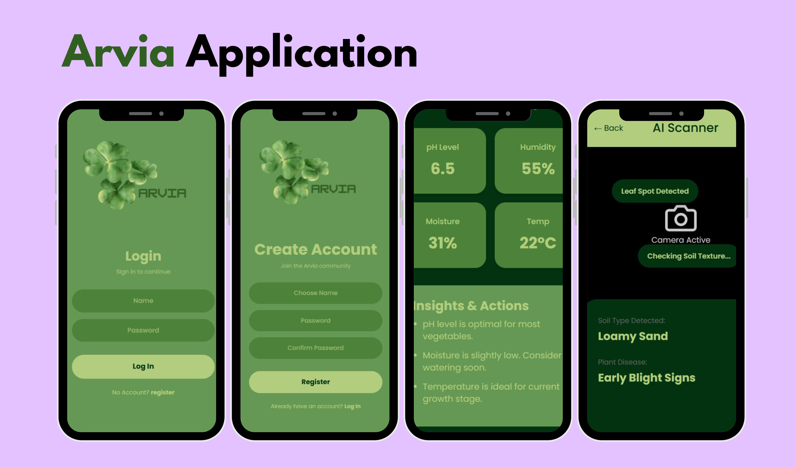
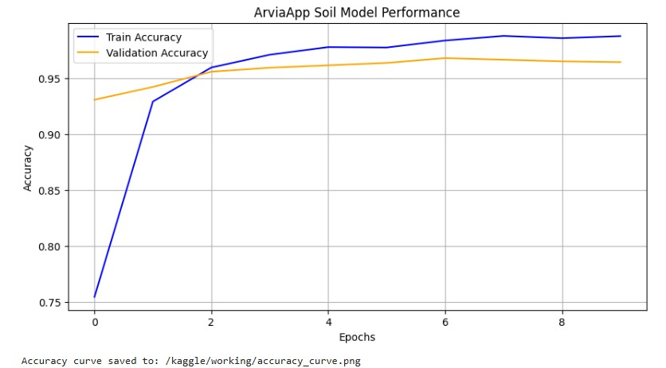
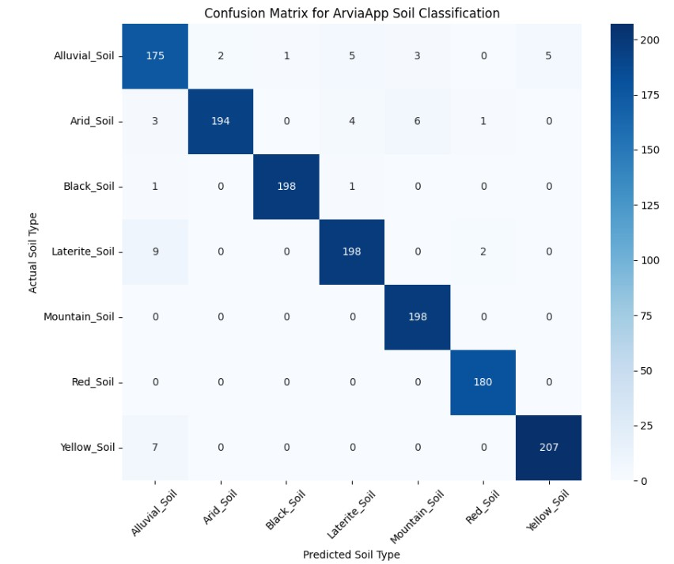
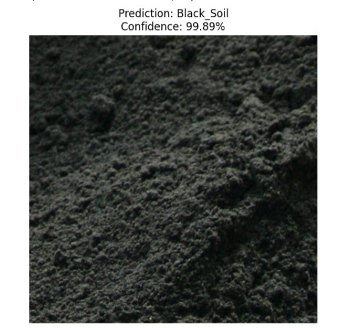

# Arvia

This is a final year project for my bachelors in software engineeering. 

## Workings

1. First the documentation was created to get the idea approved.

2. Secondly, after the approval the application prototype was created and the sensors needed had been mapped.

3. The Front-End of the application was created using React.

4. Dataset was downloaded through kaggle and was augmented with the code entered in the augmentation file.

5. The VGG16 model was trained for the soil type, showing a training accuracy of 98.9% and validation accuracy of 96%.

